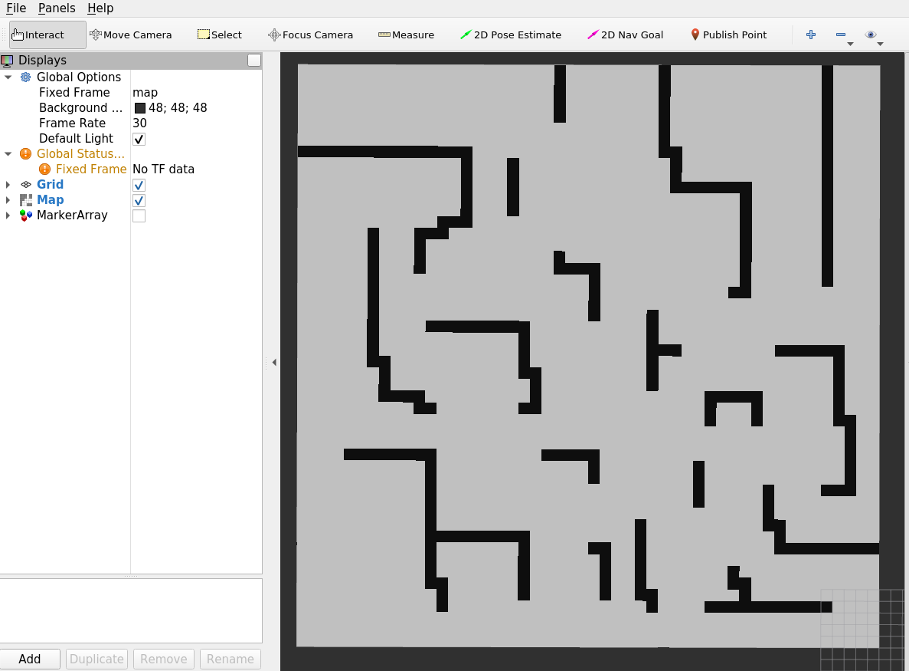
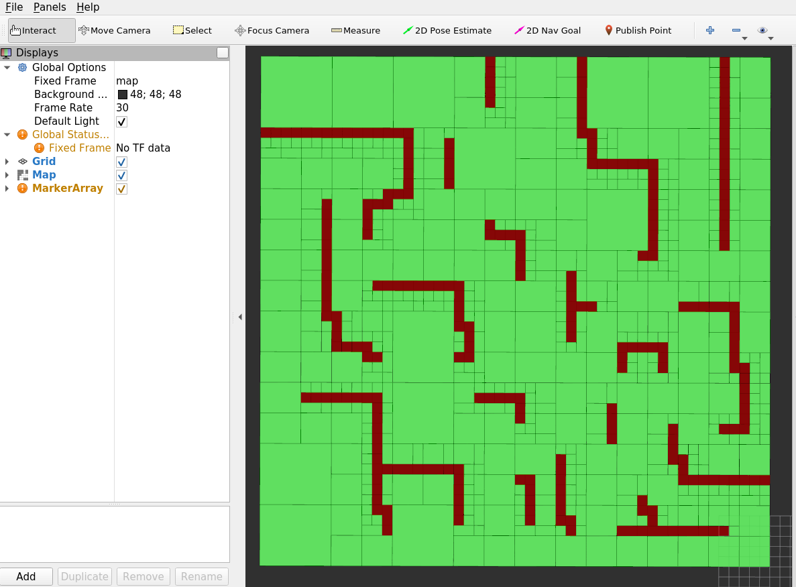

# Quadtree and A* Path Planner

This project implements **quadtrees** and an **A* path planner** from scratch. The main goal is to experiment with quadtrees and evaluate their potential to improve the efficiency of path planning.

---

## Features

- **Quadtrees Implementation**: 
  - Efficiently partition a 2D grid for spatial representation.
  - Convert grid-based data into a hierarchical tree structure.

- **A* Path Planning**: 
  - Find optimal paths on a 2D grid represented in a hierarchial tree structure.

- **Visualization**: 
  - Side-by-side comparisons of a grid and its quadtree representation.

---

## Screenshots/Visualizations

Below are two visualizations that highlight the difference between a regular grid and its quadtree representation:

### Grid Representation


### Quadtree Representation


---

## Goals of the Experiment

1. **Understand Quadtrees**: Explore their potential in simplifying grid structures for spatial tasks.
2. **Optimize Path Planning**: Check if integrating quadtrees improves the runtime and efficiency of the A* algorithm.

---

## Installation and Usage

1. Clone the repo:
   ```bash
   git clone https://github.com/asmit-mit/QuadTree_Path_Planning.git
2. Build the project:
   ```bash
   catkin_make
3. Launch the visualizer:
   ```bash
   roslaunch path_planner quad_tree_visualizer.launch
