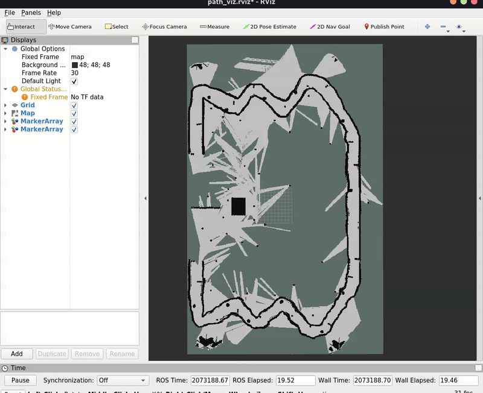
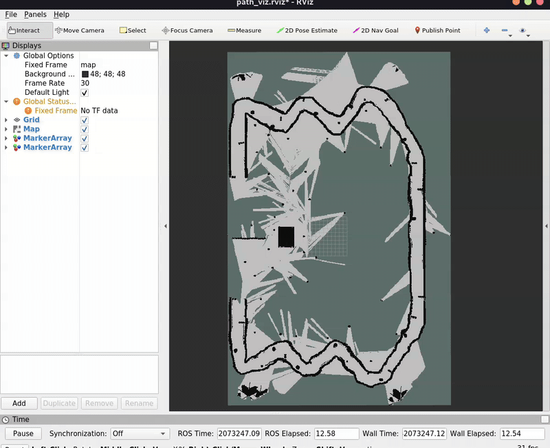
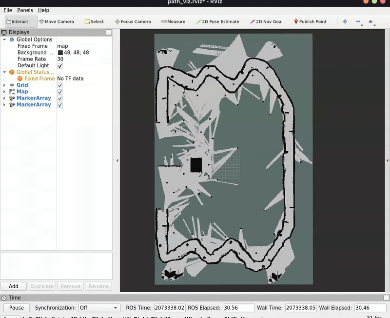

# Efficient Path Planning In ROS Occupancy Grid Using Quadtrees with A*

This project explores an efficient representation of the ROS1 Occupancy Grid using **Quadtrees**, enabling faster path planning with the **A*** algorithm. The primary focus is to compare the performance of A* on a standard grid versus A* on a quadtree.

## Motivation

Traditional grid-based representations in robotics, such as ROS1 Occupancy Grids, often come with computational overhead when planning paths using algorithms like A*. Quadtrees, as hierarchical spatial structures, allow for more efficient representation and traversal of large maps. This project investigates the trade-offs between computation speed and path accuracy when using quadtrees for A* path planning.

## Implementation

1. **Occupancy Grid Representation**:
   - The ROS1 Occupancy Grid is converted into a **quadtree structure**. 
   - Quadtrees provide a hierarchical representation by subdividing the space into quadrants until a defined resolution (max depth) is achieved.

2. **Path Planning**:
   - A* is applied on:
     - The **standard occupancy grid** (baseline approach).
     - The **quadtree representation** (optimized approach).
   - Side-by-side comparisons highlight the computational and path differences.

## Results

### Visual Comparison


*Figure 1: A* path planning on standard grid.*


*Figure 2: A* path planning on quadtree of max depth 8.*



*Figure 3: A* path planning on quadtree of infinite depth.*

### Key Observations

- **Performance**: 
  - A* on quadtrees performs significantly faster compared to A* on a standard grid.
- **Path Accuracy**:
  - The path computed on the quadtree may not be the shortest path.
  - Path accuracy depends heavily on the **maximum depth of the quadtree**.

## Conclusion

Using quadtrees to represent the ROS1 Occupancy Grid yields substantial performance improvements in A* path planning. However, the trade-off is that the generated paths might be suboptimal, with accuracy depending on the quadtree's resolution.

## Getting Started

### Usage

1. Clone this repository:
   ```bash
   git clone https://github.com/asmit-mit/QuadTree_Path_Planning.git  
   ```
2. Build the repo:
   ```bash
   cd QuadTree_Path_Planning
   catkin_make
   ```
3. Source and launch the viz:
   ```bash
   roslaunch path_planner path_planner_viz.launch
   ```
4. Give 2D Nav Goal in rviz to see the planned paths.
